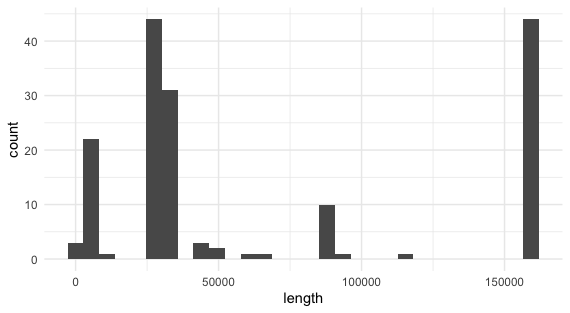
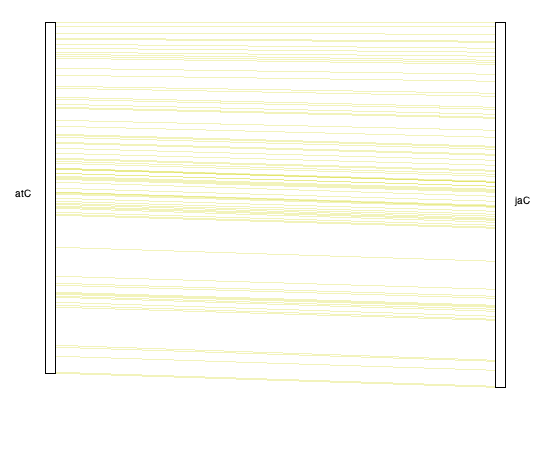

# GBCF Bioinformatics Analysis Report

- Project: JRS Chloroplasts Analysis
- Contact: Jeanne Romero-Severson
- Analysts: Elizabeth Brooks & Sheri Sanders
- Date: 28 January 2025

## Methods

The chloroplast genome sequences were filtered and formatted for analysis using custom BASH and python scripts unless otherwise noted, which are available on GitHub (https://github.com/ElizabethBrooks/GBCF_Chloroplasts). First, sequences were filtered by length to identify the longest sequence for potential reference. The sequences were then formatted for input to MCScanX [1], which was used to investigate gene content and order. The CHLOROBOX GeSeq online tool [2] and Cufflinks gffread [3] was used to annotate the chloroplast sequences and create the necessary gff and protein sequences files for the MCScanX synteny analysis. With MCScanX we verified the completeness of the longest chloroplast genome by comparing its seqeunce to the well annotated NCBI reference <i>Arabidopsis thaliana</i> (TAIR10.1) chloroplast genome assembly. Additionally, we created synteny plots for all of our samples relative to the best reference chloroplast (<i>Juglans ailanthifolia</i>). This allowed us to check for inversions of the IRb or IRa in the sequences of our samples, which would prevent full alignment of the chloroplast genomes. Alignments were created using cactus-pangenome [4] and the output hal files were converted to maf format for downstream analysis using cactus-hal2maf. Alignments were evaluated with tube maps using sequenceTubeMap [5] and the vg files output by cactus. The maf files from the vetted sequence alignments were converted to phy format. The phy files were converted to newick format using the phy2newick BASH script from FastTree. Lastly, the newick files were used with TreeDyn [6, 7] and Tree Viewer [8] to generate trees for the alignments.

## Results

Our first step was to filter the set of chloroplast sequences by length and identify the longest chloroplast genome to serve as our reference (Figure 1). There were 44 sequences that were 159,700 bases or longer. The remaining 121 sequences were 115,343 bases or shorter. The longest chloroplast sequence in our data set was from <i>Juglans ailanthifolia</i> with a length of 160,400 bases. Next, the protein sequences for the chloroplast genes of the longest chloroplast genome (<i>J. ailanthifolia</i>) were retrieved from NCBI. BLAST was run on the longest chloroplast genome to identify the associated assembly on NCBI. The name of the identified NCBI assembly also matched the header of the longest chloroplast genome. To make sure that known chloroplast genes were well represented, we compared the <i>J. ailanthifolia</i> chloroplast sequence to the <i>Arabidopsis thaliana</i> chloroplast complete genome. Synteny analysis of the longest chloroplast genomes showed that the gene content and order between the chloroplast sequences was very similar (Figure 2). There were two genes unique to A. thaliana (psbZ, psbB) and four genes unique to <i>J. ailanthifolia</i> (lhbA, psi, infA, ycf15). The psaB and psaA genes were tandem in both species. The protein sequence of the ndhD gene was very different between the species. The synteny plots for the complete set of chloroplasts showed some re-arrangements of genes in the discordant regions, which confirmed the presence of inversions of the IRb and IRa in a subset of our chloroplast sequences. 

## Figures

<b>Figure 1. Distribution of Chloroplast Sequence Lengths</b>
There are 44 sequences that are 159,700 bases or longer. The remaining 121 sequences are 115,343 bases or shorter. The longest chloroplast sequence in our data set was from <i>Juglans ailanthifolia</i> with a length of 160,400 bases. 

<b>Figure 2. Synteny of the Longest Chloroplast Genome with <i>Arabidopsis thaliana</i></b>
The gene content and order between the chloroplast sequences was very similar. There were two genes unique to A. thaliana (psbZ, psbB) and four genes unique to <i>J. ailanthifolia</i> (lhbA, psi, infA, ycf15). The psaB and psaA genes were tandem in both species.

## References

1. Wang, Y., Tang, H., Debarry, J. D., Tan, X., Li, J., Wang, X., Lee, T. H., Jin, H., Marler, B., Guo, H., Kissinger, J. C., & Paterson, A. H. (2012). MCScanX: a toolkit for detection and evolutionary analysis of gene synteny and collinearity. Nucleic acids research, 40(7), e49. https://doi.org/10.1093/nar/gkr1293
2. Tillich, M., Lehwark, P., Pellizzer, T., Ulbricht-Jones, E. S., Fischer, A., Bock, R., & Greiner, S. (2017). GeSeq - versatile and accurate annotation of organelle genomes. Nucleic acids research, 45(W1), W6–W11. https://doi.org/10.1093/nar/gkx391
3. Pertea, G., & Pertea, M. (2020). GFF Utilities: GffRead and GffCompare. F1000Research, 9, ISCB Comm J-304. https://doi.org/10.12688/f1000research.23297.2
4. Hickey, G., Monlong, J., Ebler, J., Novak, A. M., Eizenga, J. M., Gao, Y., Human Pangenome Reference Consortium, Marschall, T., Li, H., & Paten, B. (2024). Pangenome graph construction from genome alignments with Minigraph-Cactus. Nature biotechnology, 42(4), 663–673. https://doi.org/10.1038/s41587-023-01793-w
5. Beyer, W., Novak, A. M., Hickey, G., Chan, J., Tan, V., Paten, B., & Zerbino, D. R. (2019). Sequence tube maps: making graph genomes intuitive to commuters. Bioinformatics (Oxford, England), 35(24), 5318–5320. https://doi.org/10.1093/bioinformatics/btz597
6. Dereeper, A., Guignon, V., Blanc, G., Audic, S., Buffet, S., Chevenet, F., Dufayard, J. F., Guindon, S., Lefort, V., Lescot, M., Claverie, J. M., & Gascuel, O. (2008). Phylogeny.fr: robust phylogenetic analysis for the non-specialist. Nucleic acids research, 36(Web Server issue), W465–W469. https://doi.org/10.1093/nar/gkn180
7. Sebastien Santini (CNRS/AMU IGS UMR7256) and the PACA Bioinfo platform for the availability and management of the phylogeny.fr website used to visualize trees in newick format.
8. Huerta-Cepas, J., Serra, F., & Bork, P. (2016). ETE 3: Reconstruction, Analysis, and Visualization of Phylogenomic Data. Molecular biology and evolution, 33(6), 1635–1638. https://doi.org/10.1093/molbev/msw046
