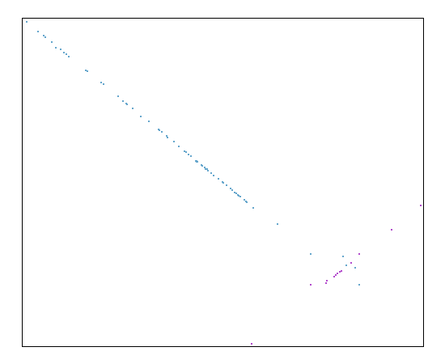
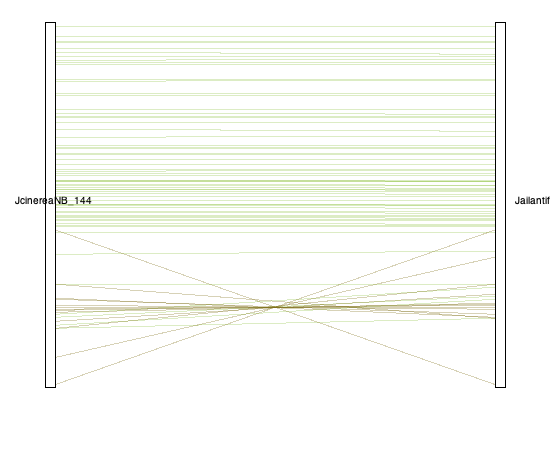
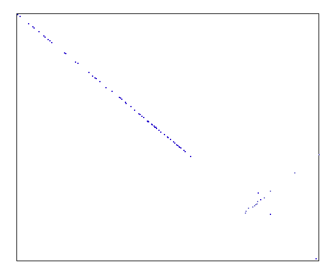
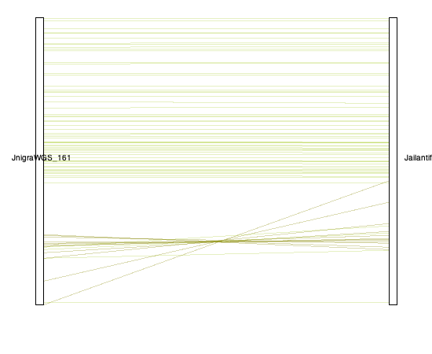

### Notes

#### Step 1

Our first step was to filter the set of chloroplast sequences by length. Please see the plot showing the distribution of sequence lengths. 

There are 44 sequences that are 159,700 bases or longer. The remaining 121 sequences are 115,343 bases or shorter. 

The longest chloroplast sequence in our data set was from Juglans ailanthifolia with a length of 160,400 bases. 

#### Step 2

The protein sequences for the chloroplast genes of the potential longest reference genome (Juglan ailanthifolia) were retrieved from NCBI, after the chloroplast genome was put through BLAST and the associated assembly was identified. The name of the associated NCBI assembly matches the header of the potential longest reference genome. 

The headers for the input chloroplast gene protein seqeunces to MCScanX should be simple so that the resulting plots are clear and easy to read.

Note that there needs to be a separate input file for each different type of plot that is created using MCScanX.

#### Step 3

To make sure that known chloroplast genes are well represented, we compared the J. ailanthifolia chloroplast (jaC) sequence to the Arabidopsis thaliana chloroplast (atC) complete genome. Please see the dual synteny plot comparing the chloroplast genomes, which shows that the gene content and order between the chloroplast sequences is very similar.

There are two genes unique to A. thaliana (psbZ, psbB) and four genes unique to J. ailanthifolia (lhbA, psi, infA, ycf15). The psaB and psaA genes are tandem in both species. The protein sequence of the ndhD gene is very different between the species.

#### Step 4

##### Idnetifying & Fixing inverted regions

To verify our suspicions regarding reversed orientation of inverted repeat regions (IRa and IRb) with the chloroplasts alignment, I created synteny plots for all of our samples relative to the best reference chloroplast (Juglans ailanthifolia, IDfileorder 136). This will allow us to check for inversions of the IRb or IRa in the sequences of the suspicious samples with apparent alignment issues.

Example synteny plots are shown below for two of the suspicious samples (144 and 161) relative to our best reference (136). The synteny plots for those chloroplasts show some re-arrangements in the dot plot (left) and dual synteny plot (right), which confirm the presence of inversions in our sequences. These regions of discordance are at the right hand end of the chloroplast sequence for each sample, and the regions contain genes found in the IRb, IRa, and SSC (see lists below).

###### 144 - JcinereaNB




Genes in the discordant region:

1. rpl2
2. rps7
3. ycf1
4. rpl32
5. psaC
6. ndhE
7. ndhG
8. ndhI
9. ndhA
10. ndhH
11. rps15
12. ycf1
13. rpl23

###### 161 - JnigraWGS




Genes in the discordant region:

1. rpl2
2. rps7
3. ycf1
4. rpl32
5. ndhD
6. psaC
7. ndhE
8. ndhG
9. ndhI
10. ndhA
11. ndhH
12. rps15

The synteny plots and data have been uploaded to the GBCF_JRS_Chloroplasts/synteny box folder for all of the chloroplast sequences. These include the suspicious sequences with alignment issues (138, 140, 142, 144, 145, 148, 149, 151, 154, 156, 158, 160, 161, 163). 

##### Fixing alignment regions
1) Compile Gene Start/Stop Points
We need to compile all the files in JRS_CHLOROBOX/formatted/ to extract the gene start and stop points for each genome and gene. This will involve combining these files into a single table.

2) Split Genomes into Four UNIQUE Parts
a) Concept: We need to split each genome into four parts, ensuring that the IRb and IRa regions are not identical. I’ve identified single-copy genes and located genes just outside the IRb and IRa regions, adding context information where possible.

  LSC: From psbA through rps19 (complete LSC section)
  IRa: From rps19 through ndhF (IRa + neighboring SSC and LSC regions)
  SSC: From ndhF through ndhA (complete SSC section)
  IRb: From ndhA through rpl2 (IRb + neighboring SSC region)

By overlapping these regions, we can position them correctly—aligning the overlap of ndhF in IRa and SSC ensures the correct orientation of IRa with SSC. The same applies to IRb, but we cannot overlap at the end of IRb, so we need to capture the latter rpl2 region (not the one by rps19).

b) Practical Steps:
Once we have the gene location list from Step 1, we’ll subset each genome based on the defined regions. The exact points will differ by genome, so this needs to be done for each affected sample (see list below).

3) Separate Genome Alignment
After splitting the genomes into four sections, we will align them individually using the same methods we’ve previously used.

4) Reassemble
Finally, we’ll combine the aligned sections, using the overlapping single copy genes (ndhA and ndhF) to force correct order. This will add geneic context to the full genome alignment, as Cactus does so well, and allow us to fix misassemblies.

##### Identifying alignment regions

We need to split each genome into four parts using single copy genes and ensuring that the IRb and IRa regions are not identical:
- LSC (from start to LSC): From psbA through rps19 (complete LSC section)
- IRa: From rps19 through ndhF (IRa + neighboring SSC and LSC regions)
- SSC: From ndhF through ndhA (complete SSC section)
- IRb (from IRb to end): From ndhA through rpl2 (IRb + neighboring SSC region)

###### Investigating discordant regions

Need to reverse complement the sequences in the SSC region, then create updated fasta and bed files. 

Test blast (refernce):
```
cat /Users/bamflappy/GBCF/JRS/chloroplast/regions/region02.txt | grep "_136" | grep "ndhF_" | sed "s/^.*_136/chloroplast/g" > /Users/bamflappy/GBCF/JRS/chloroplast/tests/136_ndhF.bed
bedtools getfasta -fi /Users/bamflappy/GBCF/JRS/chloroplast/formatted/chloroplast_genomes_renamed/*_136.fa -bed /Users/bamflappy/GBCF/JRS/chloroplast/tests/136_ndhF.bed -fo /Users/bamflappy/GBCF/JRS/chloroplast/tests/136_ndhF.fa.out
```

Test blast (discordant example):
```
cat /Users/bamflappy/GBCF/JRS/chloroplast/regions/region02.txt | grep "_142" | grep "ndhF_" | sed "s/^.*_142/chloroplast/g" > /Users/bamflappy/GBCF/JRS/chloroplast/tests/142_ndhF.bed
bedtools getfasta -fi /Users/bamflappy/GBCF/JRS/chloroplast/formatted/chloroplast_genomes_renamed/*_142.fa -bed /Users/bamflappy/GBCF/JRS/chloroplast/tests/142_ndhF.bed -fo /Users/bamflappy/GBCF/JRS/chloroplast/tests/142_ndhF.fa.out
```

Test reverse complement blast (discordant example):
```
cat /Users/bamflappy/GBCF/JRS/chloroplast/regions/region02.txt | grep "_142" | grep "ndhF_" | sed "s/^.*_142/chloroplast/g" > /Users/bamflappy/GBCF/JRS/chloroplast/tests/142_ndhF.bed
bedtools getfasta -fi /Users/bamflappy/GBCF/JRS/chloroplast/formatted/chloroplast_genomes_renamed/*_142.fa -bed /Users/bamflappy/GBCF/JRS/chloroplast/tests/142_ndhF.bed -fo /Users/bamflappy/GBCF/JRS/chloroplast/tests/142_ndhF.fa.out
```

###### Discordant sequneces
region03_142
region03_144
region03_145
region03_148
region03_163
region03_149
region03_151
region03_154
region03_156
region03_158
region03_160
region03_138
region03_140
region03_161

##### Formatting

There needs to be separate fasta files for each genome (for cactus) with the same header for each chloroplast sequence (for sequenceTubeMap). 

The input sample cannot be prefixed by the given reference using a period (e.g., Jailantifolia.136). "This is not supported by this version of Cactus, so one of these samples needs to be renamed to continue." 

Additionally, the headers for the chloroplast sequences cannot be only numeric values, since this results in an error when running cactus-hal2maf.

#### Step 7

Only a portion of the chloroplast sequences can be visualized, so this part of the analysis will need to be interactive.
